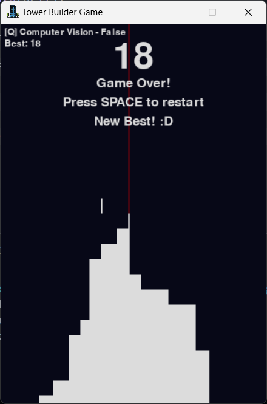

# Tower Builder Game
Tower Builder Game es un juego desarrollado con Pygame que desafía al jugador a construir la torre más alta posible apilando pisos con precisión. Cada piso se mueve horizontalmente, y el jugador debe detenerlo para que coincida con el piso anterior. Si el piso no se alinea correctamente, el juego termina.



## Requisitos del sistema
Python 3.10 o superior.

Librerías necesarias:
- pygame
- mediapipe
- opencv-python

## Instalación
1. Clona este repositorio:
   ```bash
   git clone https://github.com/usuario/tower-builder-game.git
   cd tower-builder-game
   ```

2. Instala las dependencias necesarias desde `requirements.txt`:
   ```bash
   pip install -r requirements.txt
   ```

3. Asegúrate de tener los archivos necesarios:
   - Imágenes en la carpeta `imgs` (por ejemplo, `edificio.png`).
   - Archivos de sonido en la carpeta `sounds` (`floor.mp3`, `success_1.mp3`, `gameover.mp3`).
   - Script de detección de parpadeos (`blink_detection.py`).

4. Ejecuta el juego:
   ```bash
   python main.py
   ```